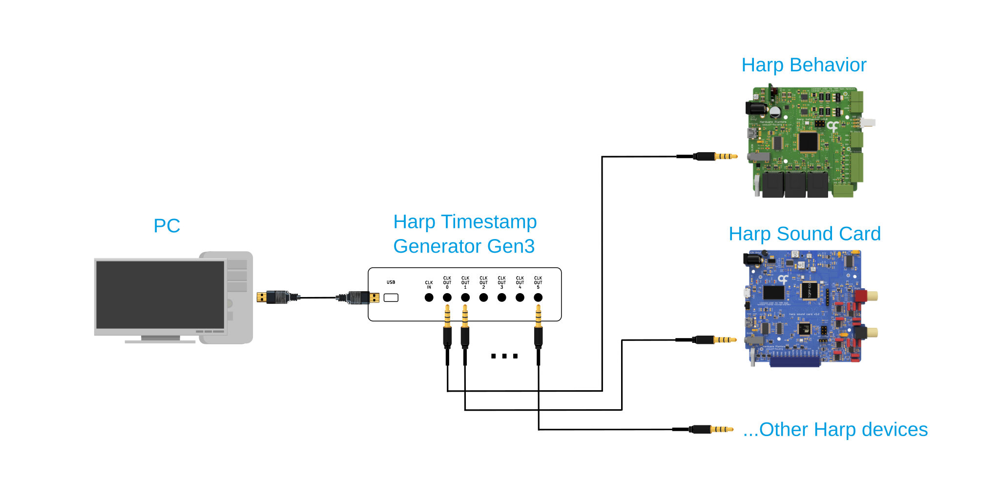
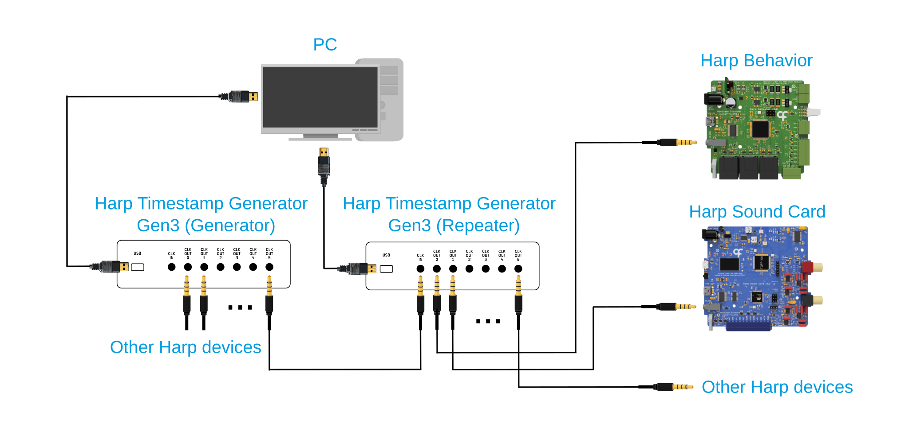

## Ports and Connections

This article will cover the ports and controls on the Timestamp Generator Gen3, as well as how to connect the device to a computer and to the Harp devices it will synchronize.

### Ports and Controls

**EXPANSION** - Reserved expansion connector on the front panel.

> [!WARNING]
> **TODO**: Document the purpose and pinout of the EXPANSION connector.

**OPTION** - Multi-function button. The executed action depends on how long the button is held and released, following the legend printed at the bottom. The indicator LEDs will also blink to let you know which option is being selected.

| Hold time | Action | Indicator LED |
| --- | --- | --- |
| ~ 1 s | Check the battery level (requires the **BATTERY** switch to be `ON`) | The battery level will be shown on the `OUT0`–`OUT2` LEDs for a few seconds (1 LED ≈ low, 3 LEDs ≈ well charged).    If the **BATTERY** switch is off it will flash low as the battery is disconnected. |
| ~ 3 s | Lock or unlock the device clock. | `LOCK` LED will blink and remain on the chosen state |
| ~ 6 s | Toggle between clock [generator and repeater](#connections) mode. The device will reboot into the new mode after the button is released. | The startup LED sequence will play after the reboot, then the `REPEAT` LED will toggle on or off |
| ≥ 12 s | Start or stop a [battery maintenance cycle](manage-battery-charging.md#control-charging-manually). | `OUT` LEDs blink together (only with external power connected). |

**BATTERY** - Connects or disconnects the internal battery. With the switch `ON`, the device keeps the clock running when external power is removed. The switch also needs to be on for [charging](./manage-battery-charging.md), or to check the [battery levels](./monitor-device-status.md)

**USB (Mini-B)** - This port connects the device to the computer running [Bonsai](harp-bonsai.md), and also provides the external power used to run the device and charge its internal battery.

**CLKIN (Stereo Jack)** - When the device is configured as a [repeater](#repeater-mode), it receives the Harp clock from an upstream Timestamp Generator Gen3 on this port instead of generating its own.

**CLKOUT (0-6, Stereo Jack)** - These ports distribute the Harp synchronization clock to up to 6 Harp devices. Connect each port to the clock input (`CLKIN`) port of a Harp device. The device automatically detects which ports have a device connected, reported by the corresponding `OUT` LED on the front panel.

### Connections

The Timestamp Generator Gen3 can be used in either one of two modes depending on the number of timestamp generators and connected devices.

#### Generator Mode

{width=600}

For synchronization of up to 6 Harp devices:
1) Connect the Timestamp Generator Gen3 to the computer over USB for power.
2) Set the device to **Generator** mode (this is the default setting).
3) Connect each of its clock output ports to the clock input port of a Harp device.

#### Repeater Mode

{width=600}

For synchronization of more than 6 Harp devices:: 
1) Connect all Timestamp Generator Gen3 units to the computer over USB for power.
2) Setup one Timestamp Generator Gen3 in **Generator** mode.
3) Connect the clock output of the generator unit to the clock input of the other Timestamp Generator Gen3 units.
4) Switch the remaining Timestamp Generator Gen3 units to **Repeater** mode.
5) Connect each of the clock output ports to the clock input port of a Harp device.

> [!NOTE]
> The Timestamp Generator Gen3 is also compatible with other Harp timestamp generators and clock synchronizers.

[!INCLUDE ]
