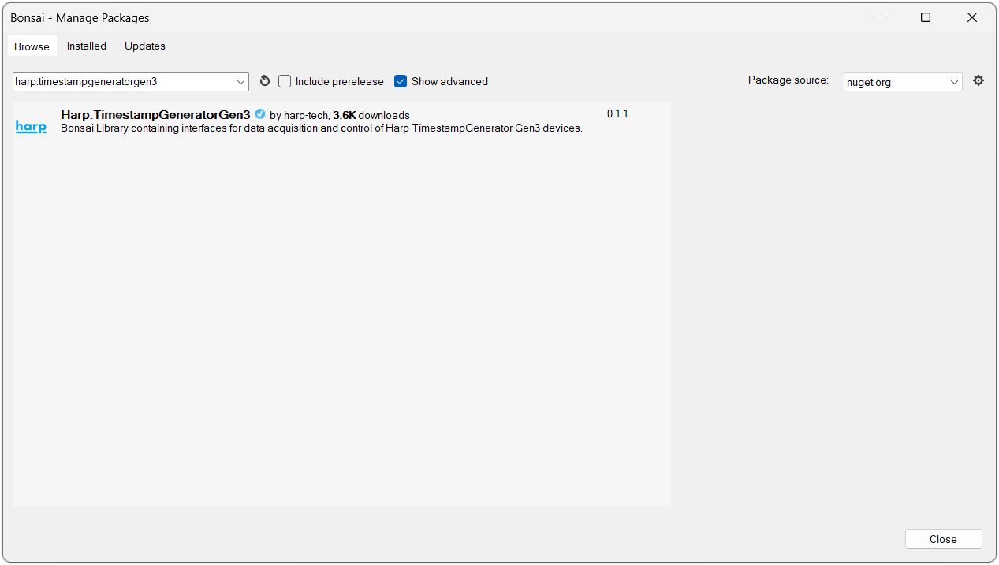
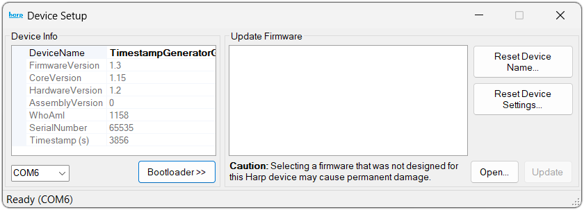

## Installation

This page covers the software you'll need to interact with the Timestamp Generator Gen3, as well as how to update the firmware on the device.

## Software Packages

These steps are only required the first time you connect the device to a new computer, and you can install just the packages for the functionality you need.

# [Bonsai](#tab/bonsai)

[Bonsai](https://bonsai-rx.org/) is a visual reactive programming language that provides flexible and comprehensive control of the Timestamp Generator Gen3.

{width=650}

- Download and install [Bonsai](https://bonsai-rx.org/docs/articles/installation.html).
- Launch Bonsai and install the `Harp.TimestampGeneratorGen3` package by searching for it in the [Bonsai package manager](https://bonsai-rx.org/docs/articles/packages.html). Tick the "Show advanced" checkbox if it does not appear. 
- (Optional) Install the `Bonsai.Windows.Input` package to follow along with the examples in this user guide.

# [harp-python](#tab/harp-python)

The [harp-python](https://pypi.org/project/harp-python/) library is a Python package for [loading and manipulating](logging-analysis.md) binary data collected from Harp devices. Install it in a Python environment with:

```cmd
pip install harp-python
```

***

## Firmware

New features are added and bugs are fixed with firmware updates which are published on the [release page](https://github.com/harp-tech/device.timestampgeneratorgen3/releases) in the Timestamp Generator Gen3 repository. Each firmware release is tagged with a `fw` version prefix (e.g. `fw1.3-harp1.15`), and the `.hex` files can be found in the "Assets" section. Download the file that matches the [hardware (`hw`) version](timestampgeneratorgen3-overview.md#hardware) of your device.

>[!TIP] 
> The hardware version is printed on the front panel of the device.

To update the firmware, use the device setup tool in Bonsai:

{width=650}

1. Add the [`Device`] operator in Bonsai.
2. Double-click on the [`Device`] node while the workflow is not running.
3. Select the COM port for the device.
4. Click "Bootloader".
5. Click "Open".
6. Select the downloaded `.hex` file.
7. Click "Update".

After the update, the device will reboot with the new firmware and go through the [startup LED sequence](connections.md#front-panel).

> [!WARNING]
> Make sure the device is running on external (USB) power during the update, not on its battery.

[!INCLUDE [](version-footer.md)]

<!--Reference Style Links -->
[`Device`]: xref:Harp.TimestampGeneratorGen3.Device
