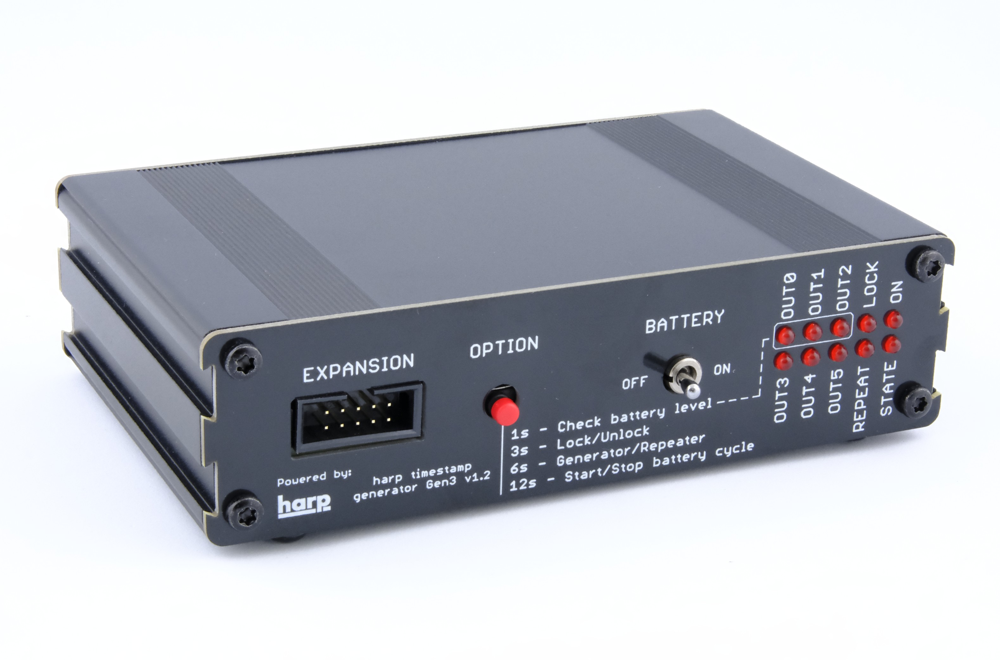

## Timestamp Generator Gen3

{width=450}

### Key Features

- Distributes the Harp synchronization clock to up to 6 Harp devices.
- Option to operate as a clock **generator** (the default) or as a **repeater** that re-distributes an incoming clock, allowing several units to be daisy-chained in larger setups.
- Internal battery to prevent clock interruption during power outages.
- Programmable clock start time with lock to avoid resetting the clock by mistake.
- LED indicators for connected devices, battery life and device status.

### Specs

- Clock inputs: 1
- Clock outputs: 6
- Timestamp resolution: 32 µs
- Synchronization accuracy: 22 +/- 16 µs
- Synchronization frequency: 1 Hz
- Battery capacity: 2 Ah (lithium polymer)
- Battery runtime: up to 24h
- Battery default charging thresholds: 3.65 V to 3.75 V ([configurable](manage-battery-charging.md))
- Battery charging safety limits: 3.35 V to 4.1 V

> [!NOTE]
> There was no existing hardware or firmware version table, but I think it is worth adding one and also a note on the previous generations (what happened to gen1 and gen2).

[!INCLUDE ]
